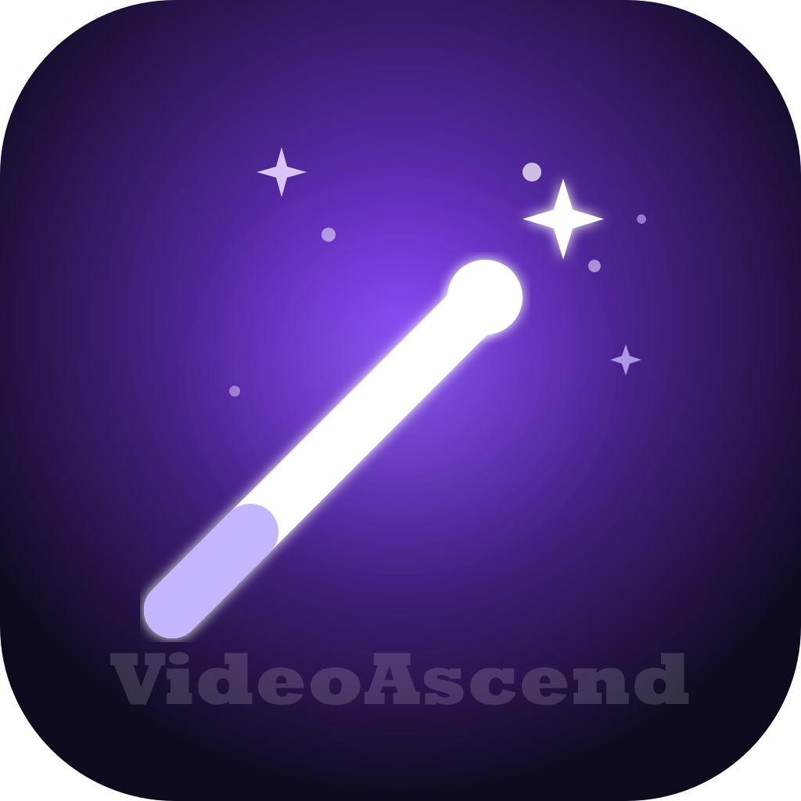

<div align="center">
  
  <h1>VideoAscend</h1>
  <p>AI-powered video super-resolution and frame interpolation<br/>
  Compact desktop app for Windows, macOS, and Linux</p>

  [](https://github.com/SiddharthSeng/VideoAscend-AI-Video-Enhancement-Desktop-App/actions)
  [](LICENSE)
  [](https://github.com/SiddharthSeng/VideoAscend-AI-Video-Enhancement-Desktop-App/releases/latest)
  [](https://github.com/SiddharthSeng/VideoAscend-AI-Video-Enhancement-Desktop-App/releases)
</div>

---

## What it does

VideoAscend takes low-resolution videos and upscales them using
AI-based algorithms, running entirely on your local machine.
No cloud upload. No subscription. No data leaves your computer.

- Upscale 480p anime to 4K using Anime4K or Real-ESRGAN
- Interpolate 24fps video to 60fps or 120fps
- Process multiple files in a queue with drag-and-drop reordering
- GPU-accelerated encoding on NVIDIA, AMD, Intel, and Apple Silicon

---

## Features

| | |
|---|---|
| 🎌 **Upscaling** | Anime4K v4, Real-ESRGAN, Real-CUGAN |
| 🎬 **Interpolation** | RIFE-style via FFmpeg minterpolate |
| ⚡ **GPU acceleration** | NVENC · AMF · VideoToolbox · QuickSync · CPU fallback |
| 📦 **Batch processing** | Multi-file drop, sequential queue |
| 🎨 **Presets** | 5 built-in + unlimited custom |
| 🤖 **AI Advisor** | Claude-powered assistant (optional) |
| 🔄 **Auto-updates** | In-app notification + one-click install |
| 🌙 **Themes** | Dark / Light, follows OS preference |
| 🪟 **Compact UI** | 480×640 floating panel, always-on-top option |

---

## Download

**[→ Latest Release](https://github.com/SiddharthSeng/VideoAscend-AI-Video-Enhancement-Desktop-App/releases/latest)**

---

### 🪟 Windows

| File | Type | Size |
|---|---|---|
| [`VideoAscend-6.5.0-Setup.exe`](https://github.com/SiddharthSeng/VideoAscend-AI-Video-Enhancement-Desktop-App/releases/download/v6.5.0/VideoAscend%20Setup%206.5.0.exe) | Installer (recommended) | ~215 MB |
| [`VideoAscend-6.5.0-Portable.exe`](https://github.com/SiddharthSeng/VideoAscend-AI-Video-Enhancement-Desktop-App/releases/download/v6.5.0/VideoAscend%206.5.0.exe) | Portable — no install needed | ~112 MB |

> If Windows SmartScreen appears, click **More info** → **Run anyway**.

---

### 🍎 macOS

| File | Type | Chip |
|---|---|---|
| [`VideoAscend-6.5.0-mac-arm64.dmg`](https://github.com/SiddharthSeng/VideoAscend-AI-Video-Enhancement-Desktop-App/releases/download/v6.5.0/VideoAscend-6.5.0-arm64.dmg) | Disk image (recommended) | Apple Silicon (M1/M2/M3/M4) |
| [`VideoAscend-6.5.0-mac-x64.dmg`](https://github.com/SiddharthSeng/VideoAscend-AI-Video-Enhancement-Desktop-App/releases/download/v6.5.0/VideoAscend-6.5.0.dmg) | Disk image | Intel |
| [`VideoAscend-6.5.0-arm64-mac.zip`](https://github.com/SiddharthSeng/VideoAscend-AI-Video-Enhancement-Desktop-App/releases/download/v6.5.0/VideoAscend-6.5.0-arm64-mac.zip) | ZIP archive | Apple Silicon |
| [`VideoAscend-6.5.0-mac.zip`](https://github.com/SiddharthSeng/VideoAscend-AI-Video-Enhancement-Desktop-App/releases/download/v6.5.0/VideoAscend-6.5.0-mac.zip) | ZIP archive | Intel |

> **First launch:** Right-click the app → **Open**, then click **Open**
> in the dialog. This bypasses the unsigned app warning.
> You only need to do this once.

---

### 🐧 Linux

| File | Type | Distro |
|---|---|---|
| [`VideoAscend-6.5.0-x86_64.AppImage`](https://github.com/SiddharthSeng/VideoAscend-AI-Video-Enhancement-Desktop-App/releases/download/v6.5.0/VideoAscend-6.5.0.AppImage) | AppImage (recommended) | Any distro |
| [`videoascend-6.5.0-amd64.deb`](https://github.com/SiddharthSeng/VideoAscend-AI-Video-Enhancement-Desktop-App/releases/download/v6.5.0/videoascend_6.5.0_amd64.deb) | Debian package | Ubuntu / Debian |
| [`videoascend-6.5.0-x86_64.rpm`](https://github.com/SiddharthSeng/VideoAscend-AI-Video-Enhancement-Desktop-App/releases/download/v6.5.0/videoascend-6.5.0.x86_64.rpm) | RPM package | Fedora / RHEL |
| [`VideoAscend-6.5.0-arm64.AppImage`](https://github.com/SiddharthSeng/VideoAscend-AI-Video-Enhancement-Desktop-App/releases/download/v6.5.0/VideoAscend-6.5.0-arm64.AppImage) | AppImage | ARM64 devices |

> **AppImage:** Make executable first:
> ```bash
> chmod +x VideoAscend-*.AppImage
> ./VideoAscend-*.AppImage
> ```

---

### System Requirements

| | Minimum | Recommended |
|---|---|---|
| **OS** | Windows 10, macOS 11, Ubuntu 20.04 | Windows 11, macOS 13, Ubuntu 22.04 |
| **RAM** | 4 GB | 16 GB |
| **GPU** | Any (CPU fallback) | NVIDIA RTX / AMD RX 6000 / Apple M1+ |
| **Storage** | 500 MB free | 5 GB+ for output files |

---

## System Requirements

| | Minimum | Recommended |
|---|---|---|
| OS | Windows 10, macOS 11, Ubuntu 20.04 | Windows 11, macOS 13, Ubuntu 22.04 |
| RAM | 4 GB | 16 GB |
| GPU | Any (CPU fallback available) | NVIDIA RTX / AMD RX 6000 / Apple M1+ |
| Storage | 500 MB free | 5 GB+ for output files |

---

## AI Advisor (Optional)

The built-in AI Advisor is powered by Claude (Anthropic).
It is **completely optional** — all video processing works without it.

To enable:
1. Get a free API key at [console.anthropic.com](https://console.anthropic.com)
2. Open VideoAscend → click **✨** in the titlebar
3. Enter your key — it is encrypted and stored locally
4. Your key is never sent anywhere except directly to Anthropic's API

The advisor can recommend algorithms based on your content, estimate
processing time, and apply settings for you automatically.

---

## Development

See [CONTRIBUTING.md](CONTRIBUTING.md) for full setup instructions.

```bash
git clone https://github.com/SiddharthSeng/VideoAscend-AI-Video-Enhancement-Desktop-App
cd videoscend
npm install
npm run dev
```

---

## License

[AGPL-3.0](LICENSE) — free and open source forever.
Built with Electron, React, FFmpeg, and Sharp.
AI Advisor powered by [Claude](https://anthropic.com).
